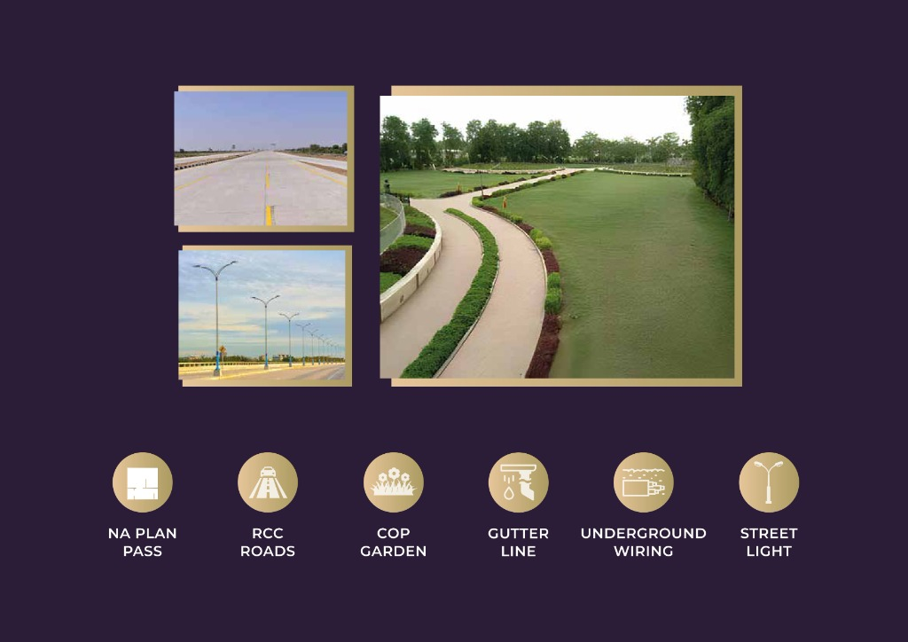

<div align="center">
  
  
  # Textile Valley
  
  **Premium Industrial Park in South Gujarat**

  [Live Demo](#) · [Report Bug](#) · [Request Feature](#)
</div>

---

## 🌟 Overview

**Textile Valley** is a state-of-the-art interactive platform showcasing South Gujarat's premier industrial and textile manufacturing park. Built with Next.js and Tailwind CSS, the platform provides potential investors and businesses with an immersive, highly-interactive Master Plan to explore, inquire about, and reserve industrial plots.

## ✨ Key Features

* **🗺️ Interactive Master Plan:** A fully interactive, SVG-based mapping system built over a high-resolution base layout. 
* **🖱️ Plot Exploration:** Hover and click on individual plots to view real-time data including area size, dimensions, road width, and current availability status.
* **📱 Responsive Design:** Flawlessly responsive luxury UI designed to look stunning on both desktop and mobile devices.
* **💬 Instant Inquiry:** Integrated direct-to-WhatsApp reservation and inquiry system.
* **🎨 Premium Aesthetics:** Features a sophisticated color palette, glassmorphism UI elements, and fluid animations powered by Framer Motion.

## 🛠️ Tech Stack

* **Framework:** [Next.js](https://nextjs.org/) (React 18)
* **Styling:** [Tailwind CSS](https://tailwindcss.com/)
* **Animations:** [Framer Motion](https://www.framer.com/motion/)
* **Icons:** [Lucide React](https://lucide.dev/)
* **Language:** TypeScript

## 🚀 Getting Started

To run this project locally, follow these simple steps:

### Prerequisites
Make sure you have Node.js and npm (or yarn/pnpm) installed.

### Installation

1. Clone the repository
   ```sh
   git clone https://github.com/MdDevCoder/Textile-Valley.git
   ```
2. Navigate into the directory
   ```sh
   cd Textile-Valley
   ```
3. Install dependencies
   ```sh
   npm install
   ```
4. Start the development server
   ```sh
   npm run dev
   ```
5. Open [http://localhost:3000](http://localhost:3000) in your browser.

## 🗺️ Master Plan Editor (Internal)

The interactive plot map features a built-in coordinate tracing tool to map geometric SVG points precisely onto the base image. To access the map editor:
1. Open `src/components/master-plan/PlotLayer.tsx`
2. Change `const EDIT_MODE = false;` to `true`.
3. Drag the red anchor points to trace new plots and click **"COPY TRACED JSON"** to export the coordinates.

## 📄 License

Distributed under the MIT License. See `LICENSE` for more information.

---
<div align="center">
  <i>Designed for seamless investor experience and premium industrial showcasing.</i>
</div>
